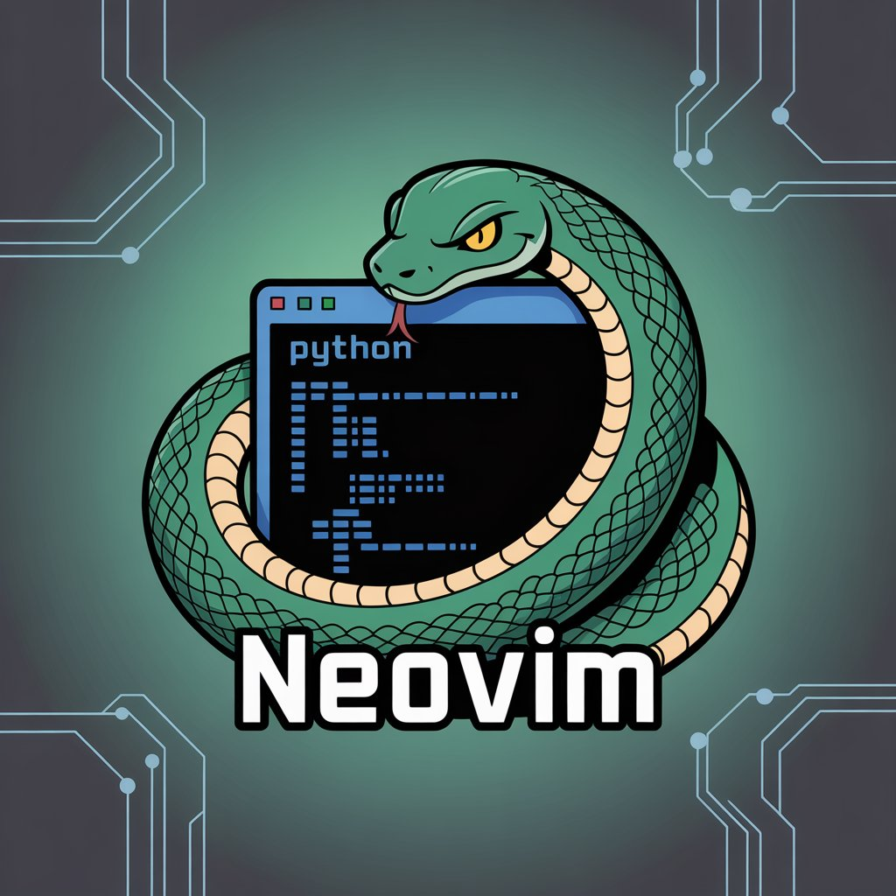

<div align="center">



# PyIDE

[](#license)


An easier way for python development [NVIM](https://github.com/neovim/neovim).

</div>

## Features:
- Auto Completion
- LSP
- FuzzyFinder
- Grep on all files
- Telescope

## Package Manager Install
```bash
git clone --depth 1 https://github.com/wbthomason/packer.nvim\
 ~/.local/share/nvim/site/pack/packer/start/packer.nvim
```

## Clone the repository
```bash
git clone https://github.com/gjyotin305/PyDE.git ~/.config/nvim
```

## Start Neovim
```bash
nvim
:PackerSync ## To sync all packages
:LspInstall pyright
```
